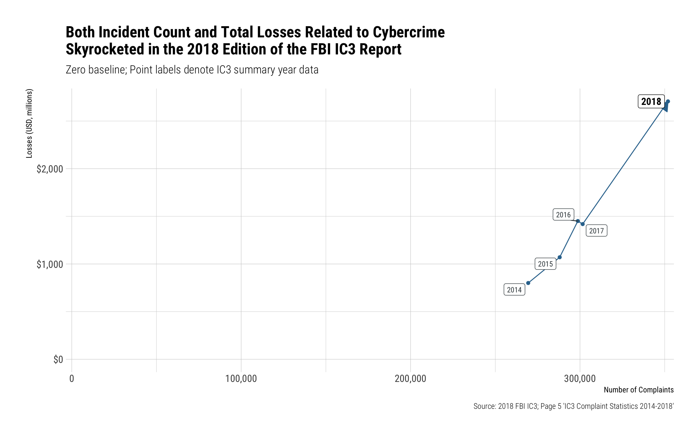
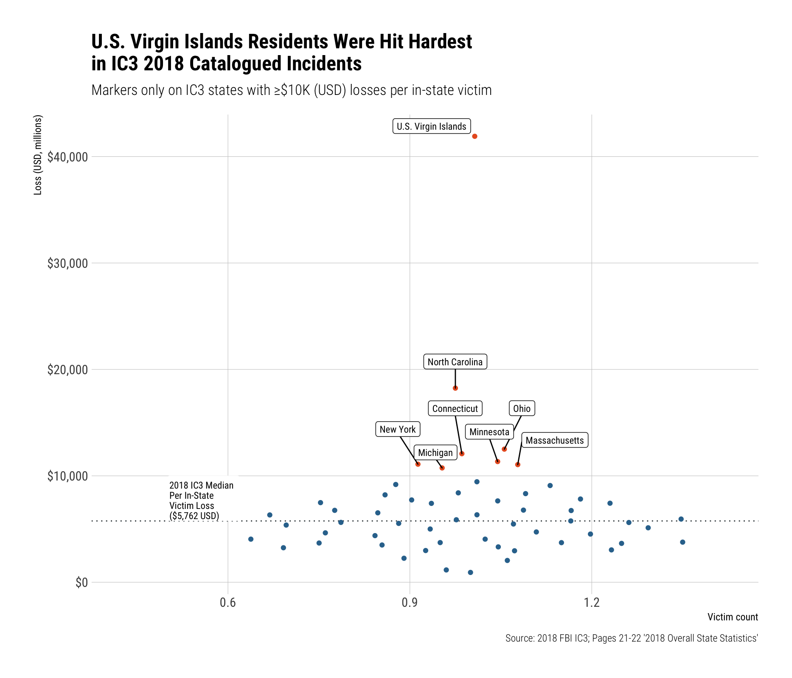

2018 FBI IC3 PDF Data Wrangling
================

``` r
library(readxl)
library(ggbeeswarm)
library(pdftools)
library(stringi)
library(hrbrthemes)
library(ggrepel)
library(tidyverse)
```

``` r
tibble(
  year = 2014:2018,
  complaints = c(269422, 288012, 298728, 301580, 351937),
  losses = c(800.5, 1070.7, 1450.7, 1418.7, 2706.4)
) -> ic3_summary

write_csv(ic3_summary, here::here("data/2018-ic3-annual-summary.csv"))

ggplot(ic3_summary, aes(complaints, losses)) +
  geom_path(
    arrow = arrow(type = "closed", length = unit(12, "pt")),
    color = "#31739C"
  ) +
  geom_point(color = "#31739C") +
  geom_label_repel(
    aes(label = year), family = font_rc, size = c(rep(3, 4), 4),
    color = c(rep("#3B454A", 4), "black"),
    fontface = c(rep("plain", 4), "bold")
  ) +
  scale_x_comma(limits = c(0, NA)) +
  scale_y_continuous(label = scales::dollar, limits = c(0, NA)) +
  labs(
    x = "Number of Complaints", y = "Losses (USD, millions)",
    title = "Both Incident Count and Total Losses Related to Cybercrime\nSkyrocketed in the 2018 Edition of the FBI IC3 Report",
    subtitle = "Zero baseline; Point labels denote IC3 summary year data",
    caption = "Source: 2018 FBI IC3; Page 5 'IC3 Complaint Statistics 2014-2018'"
  ) +
  theme_ipsum_rc()
```



``` r
ic3 <- pdf_text(here::here("raw/2018_IC3Report.pdf"))

ic3[[16]] %>% 
  stri_split_lines() %>% 
  unlist() %>% 
  stri_trim_both() -> l

l[which(stri_detect_regex(l, "^Under")):which(stri_detect_regex(l, "^Over 6"))] %>% 
  stri_split_regex("[[:space:]]{3,}", simplify = TRUE) %>% 
  as.data.frame(stringsAsFactors = FALSE) %>% 
  set_names("age_group", "incidents", "losses") %>% 
  as_tibble() %>% 
  mutate(losses = stri_replace_first_fixed(losses, "$", "")) %>% 
  type_convert(
    col_types = cols(
      age_group = col_character(),
      incidents = col_number(),
      losses = col_number()
    )
  ) -> loss

write_csv(loss, here::here("data/2018-fbi-ic3-loss-by-age.csv"))

mutate(loss, `Loss Ratio (USD, milions)` = losses/incidents) %>% 
  rename(
    `Total Losses (USD, milions)` = losses,
    `Total Incidents` = incidents
  ) %>% 
  mutate(age_group = stri_replace_first_fixed(age_group, " ", "\n")) %>% 
  mutate(age_group = factor(age_group, age_group)) %>% 
  gather(measure, value, -age_group) %>% 
  mutate(
    measure = factor(measure, levels = c(
      "Total Incidents", "Total Losses (USD, milions)", "Loss Ratio (USD, milions)"))
  ) %>% 
  ggplot(aes(age_group, value)) +
  geom_col(width=0.45, fill = "#31739C") +
  scale_x_discrete() +
  scale_y_comma() +
  facet_wrap(~measure, scales = "free") +
  labs(
    x = NULL, y = "Loss Ratio (total losses/victim count)",
    title = "In 2018, Older Victims Generally Lost More Overall and Per-Incident Than Younger Victims",
    subtitle = "Note that 40-49 age group had more incients than older groups but fewer overall losses.",
    caption = "NOTE: Free Y Scale\nSource: 2018 FBI IC3; Page 16 '2018 Victims by Age Group'"
  ) +
  theme_ipsum_rc(grid="Y")
```


``` r
ic3[[19]] %>% 
  stri_split_lines() %>% 
  unlist() %>% 
  keep(stri_detect_regex, "^[[:upper:]]") %>% 
  keep(stri_detect_regex, "[[:digit:]]") %>% 
  stri_replace_first_regex("([[:digit:]])   ([[:alpha:]\\*])", "$1\t$2") %>% 
  stri_split_fixed("\t") %>% 
  unlist() %>% 
  keep(stri_detect_regex, " [[:digit:]]") %>% 
  stri_match_first_regex("([^[:digit:]]+)([[:digit:],]+)$") %>% 
  .[,2:3] %>% 
  as.data.frame(stringsAsFactors=FALSE) %>% 
  as_tibble() %>% 
  mutate_all(.funs = stri_trim_both) %>% 
  type_convert(
    col_types = cols(
      V1 = col_character(),
      V2 = col_number()
    )
  ) %>% 
  mutate(V1 = case_when(
    stri_detect_fixed(V1, "IPR/Copy") ~ "IPR/Copyright and Counterfeit",
    TRUE ~ V1
  )) %>% 
  set_names(c("crime", "victim_count")) %>% 
  head(-2) %>% 
  arrange(desc(victim_count)) -> victims

ic3[[20]] %>% 
  stri_split_lines() %>% 
  unlist() %>% 
  keep(stri_detect_regex, "^    [[:upper:]]") %>% 
  keep(stri_detect_regex, "[[:digit:]]") %>% 
  stri_trim_both() %>% 
  stri_replace_first_regex("([[:digit:]])   ([[:alpha:]\\*])", "$1\t$2") %>% 
  stri_split_fixed("\t") %>% 
  unlist() %>% 
  stri_replace_first_regex("([[:digit:]])[[:space:]]+([[:alpha:]\\*])", "$1\t$2") %>% 
  stri_split_fixed("\t") %>%  
  unlist() %>% 
  keep(stri_detect_regex, "\\$[[:digit:]]") %>% 
  stri_match_first_regex("([^\\$]+)([\\$[:digit:],\\.]+)$") %>% 
  .[,2:3] %>% 
  as.data.frame(stringsAsFactors=FALSE) %>% 
  as_tibble() %>% 
  mutate_all(.funs = stri_trim_both) %>% 
  mutate(V2 = stri_replace_first_fixed(V2, "$", "")) %>% 
  type_convert(
    col_types = cols(
      V1 = col_character(),
      V2 = col_number()
    )
  ) %>% 
  mutate(V1 = case_when(
    stri_detect_fixed(V1, "IPR/Copy") ~ "IPR/Copyright and Counterfeit",
    stri_detect_fixed(V1, "Malware/Sca") ~ "Malware/Scareware/Virus",
    stri_detect_fixed(V1, "Harassment/T") ~ "Harassment/Threats of Violence",
    stri_detect_fixed(V1, "Ransomware") ~ "Ransomware",
    stri_detect_fixed(V1, "Denial of Service") ~ "Denial of Service/TDoS",
    stri_detect_fixed(V1, "Re-Shipping") ~ "Re-shipping",
    TRUE ~ V1
  )) %>% 
  set_names(c("crime", "loss")) %>% 
  head(-2) %>% 
  left_join(victims, "crime") %>% 
  mutate(loss = loss / 1000000) -> crime_types

write_csv(crime_types, here::here("data/2018-fbi-ic3-loss-by-crime-type.csv"))

ggplot() +
  geom_point(
    data = mutate(crime_types, color = case_when(
      (loss >= 100) | (victim_count >= 20000) ~ "#E85E26",
      TRUE ~ "#31739C"
    )), 
    aes(victim_count, loss, color = I(color))
  ) +
  geom_label_repel(
    data = filter(crime_types, (loss >= 100) | (victim_count >= 20000)),
    aes(victim_count, loss, label = crime),
    size = 3, family = font_rc
  ) +
  scale_x_comma() +
  scale_y_continuous(label = scales::dollar) +
  labs(
    x = "Victim count", y = "Loss (USD, millions)",
    title = "[Business] E-mail Account Compromise was the Most Profitable\nIC3 Crime in 2018 with over $1.2 billion (USD) in Losses",
    subtitle = "Markers only on IC3 crimes with ≥$100m (USD) losses or ≥20,000 victims ",
    caption = "Source: 2018 FBI IC3; Pages 19-20 '2018 Crime Types'"
  ) +
  theme_ipsum_rc(grid="XY")
```


``` r
arrange(crime_types, desc(loss)) %>% 
  select(`Crime` = 1, `Loss (USD, millions)` = 2, `Victim Count` = 3) %>% 
  gt::gt() %>% 
  gt::fmt_number("Victim Count", decimals = 0) %>% 
  gt::fmt_currency("Loss (USD, millions)", decimals = 2)
```

<!--html_preserve-->

<style>html {
  font-family: -apple-system, BlinkMacSystemFont, 'Segoe UI', Roboto, Oxygen, Ubuntu, Cantarell, 'Fira Sans', 'Droid Sans', 'Helvetica Neue', Arial, sans-serif;
}

#bndkqqmqox .gt_table {
  border-collapse: collapse;
  margin-left: auto;
  margin-right: auto;
  color: #000000;
  font-size: 16px;
  background-color: #FFFFFF;
  /* table.background.color */
  width: auto;
  /* table.width */
  border-top-style: solid;
  /* table.border.top.style */
  border-top-width: 2px;
  /* table.border.top.width */
  border-top-color: #A8A8A8;
  /* table.border.top.color */
}

#bndkqqmqox .gt_heading {
  background-color: #FFFFFF;
  /* heading.background.color */
  border-bottom-color: #FFFFFF;
}

#bndkqqmqox .gt_title {
  color: #000000;
  font-size: 125%;
  /* heading.title.font.size */
  padding-top: 4px;
  /* heading.top.padding */
  padding-bottom: 1px;
  border-bottom-color: #FFFFFF;
  border-bottom-width: 0;
}

#bndkqqmqox .gt_subtitle {
  color: #000000;
  font-size: 85%;
  /* heading.subtitle.font.size */
  padding-top: 1px;
  padding-bottom: 4px;
  /* heading.bottom.padding */
  border-top-color: #FFFFFF;
  border-top-width: 0;
}

#bndkqqmqox .gt_bottom_border {
  border-bottom-style: solid;
  /* heading.border.bottom.style */
  border-bottom-width: 2px;
  /* heading.border.bottom.width */
  border-bottom-color: #A8A8A8;
  /* heading.border.bottom.color */
}

#bndkqqmqox .gt_column_spanner {
  border-bottom-style: solid;
  border-bottom-width: 2px;
  border-bottom-color: #A8A8A8;
  padding-top: 4px;
  padding-bottom: 4px;
}

#bndkqqmqox .gt_col_heading {
  color: #000000;
  background-color: #FFFFFF;
  /* column_labels.background.color */
  font-size: 16px;
  /* column_labels.font.size */
  font-weight: initial;
  /* column_labels.font.weight */
  padding: 10px;
  margin: 10px;
}

#bndkqqmqox .gt_sep_right {
  border-right: 5px solid #FFFFFF;
}

#bndkqqmqox .gt_group_heading {
  padding: 8px;
  color: #000000;
  background-color: #FFFFFF;
  /* stub_group.background.color */
  font-size: 16px;
  /* stub_group.font.size */
  font-weight: initial;
  /* stub_group.font.weight */
  border-top-style: solid;
  /* stub_group.border.top.style */
  border-top-width: 2px;
  /* stub_group.border.top.width */
  border-top-color: #A8A8A8;
  /* stub_group.border.top.color */
  border-bottom-style: solid;
  /* stub_group.border.bottom  .style */
  border-bottom-width: 2px;
  /* stub_group.border.bottom  .width */
  border-bottom-color: #A8A8A8;
  /* stub_group.border.bottom  .color */
}

#bndkqqmqox .gt_empty_group_heading {
  padding: 0.5px;
  color: #000000;
  background-color: #FFFFFF;
  /* stub_group.background.color */
  font-size: 16px;
  /* stub_group.font.size */
  font-weight: initial;
  /* stub_group.font.weight */
  border-top-style: solid;
  /* stub_group.border.top.style */
  border-top-width: 2px;
  /* stub_group.border.top.width */
  border-top-color: #A8A8A8;
  /* stub_group.border.top.color */
  border-bottom-style: solid;
  /* stub_group.border.bottom  .style */
  border-bottom-width: 2px;
  /* stub_group.border.bottom  .width */
  border-bottom-color: #A8A8A8;
  /* stub_group.border.bottom  .color */
}

#bndkqqmqox .gt_striped tr:nth-child(even) {
  background-color: #f2f2f2;
}

#bndkqqmqox .gt_row {
  padding: 10px;
  /* row.padding */
  margin: 10px;
}

#bndkqqmqox .gt_stub {
  border-right-style: solid;
  border-right-width: 2px;
  border-right-color: #A8A8A8;
  text-indent: 5px;
}

#bndkqqmqox .gt_stub.gt_row {
  background-color: #FFFFFF;
}

#bndkqqmqox .gt_summary_row {
  background-color: #FFFFFF;
  /* summary_row.background.color */
  padding: 6px;
  /* summary_row.padding */
  text-transform: inherit;
  /* summary_row.text_transform */
}

#bndkqqmqox .gt_first_summary_row {
  border-top-style: solid;
  border-top-width: 2px;
  border-top-color: #A8A8A8;
}

#bndkqqmqox .gt_table_body {
  border-top-style: solid;
  /* field.border.top.style */
  border-top-width: 2px;
  /* field.border.top.width */
  border-top-color: #A8A8A8;
  /* field.border.top.color */
  border-bottom-style: solid;
  /* field.border.bottom.style */
  border-bottom-width: 2px;
  /* field.border.bottom.width */
  border-bottom-color: #A8A8A8;
  /* field.border.bottom.color */
}

#bndkqqmqox .gt_footnote {
  font-size: 90%;
  /* footnote.font.size */
  padding: 4px;
  /* footnote.padding */
}

#bndkqqmqox .gt_sourcenote {
  font-size: 90%;
  /* sourcenote.font.size */
  padding: 4px;
  /* sourcenote.padding */
}

#bndkqqmqox .gt_center {
  text-align: center;
}

#bndkqqmqox .gt_left {
  text-align: left;
}

#bndkqqmqox .gt_right {
  text-align: right;
  font-variant-numeric: tabular-nums;
}

#bndkqqmqox .gt_font_normal {
  font-weight: normal;
}

#bndkqqmqox .gt_font_bold {
  font-weight: bold;
}

#bndkqqmqox .gt_font_italic {
  font-style: italic;
}

#bndkqqmqox .gt_super {
  font-size: 65%;
}

#bndkqqmqox .gt_footnote_glyph {
  font-style: italic;
  font-size: 65%;
}
</style>

<div id="bndkqqmqox">

<!--gt table start-->

<table class="gt_table">

<tr>

<th class="gt_col_heading gt_left" rowspan="1" colspan="1">

Crime

</th>

<th class="gt_col_heading gt_right" rowspan="1" colspan="1">

Loss (USD, millions)

</th>

<th class="gt_col_heading gt_right" rowspan="1" colspan="1">

Victim Count

</th>

</tr>

<tbody class="gt_table_body gt_striped">

<tr>

<td class="gt_row gt_left">

BEC/EAC

</td>

<td class="gt_row gt_right">

$1,297.80

</td>

<td class="gt_row gt_right">

20,373

</td>

</tr>

<tr>

<td class="gt_row gt_left">

Confidence Fraud/Romance

</td>

<td class="gt_row gt_right">

$362.50

</td>

<td class="gt_row gt_right">

18,493

</td>

</tr>

<tr>

<td class="gt_row gt_left">

Investment

</td>

<td class="gt_row gt_right">

$252.96

</td>

<td class="gt_row gt_right">

3,693

</td>

</tr>

<tr>

<td class="gt_row gt_left">

Non-Payment/Non-Delivery

</td>

<td class="gt_row gt_right">

$183.83

</td>

<td class="gt_row gt_right">

65,116

</td>

</tr>

<tr>

<td class="gt_row gt_left">

Real Estate/Rental

</td>

<td class="gt_row gt_right">

$149.46

</td>

<td class="gt_row gt_right">

11,300

</td>

</tr>

<tr>

<td class="gt_row gt_left">

Personal Data Breach

</td>

<td class="gt_row gt_right">

$148.89

</td>

<td class="gt_row gt_right">

50,642

</td>

</tr>

<tr>

<td class="gt_row gt_left">

Corporate Data Breach

</td>

<td class="gt_row gt_right">

$117.71

</td>

<td class="gt_row gt_right">

2,480

</td>

</tr>

<tr>

<td class="gt_row gt_left">

Identity Theft

</td>

<td class="gt_row gt_right">

$100.43

</td>

<td class="gt_row gt_right">

16,128

</td>

</tr>

<tr>

<td class="gt_row gt_left">

Advanced Fee

</td>

<td class="gt_row gt_right">

$92.27

</td>

<td class="gt_row gt_right">

16,362

</td>

</tr>

<tr>

<td class="gt_row gt_left">

Credit Card Fraud

</td>

<td class="gt_row gt_right">

$88.99

</td>

<td class="gt_row gt_right">

15,210

</td>

</tr>

<tr>

<td class="gt_row gt_left">

Extortion

</td>

<td class="gt_row gt_right">

$83.36

</td>

<td class="gt_row gt_right">

51,146

</td>

</tr>

<tr>

<td class="gt_row gt_left">

Spoofing

</td>

<td class="gt_row gt_right">

$70.00

</td>

<td class="gt_row gt_right">

15,569

</td>

</tr>

<tr>

<td class="gt_row gt_left">

Government Impersonation

</td>

<td class="gt_row gt_right">

$64.21

</td>

<td class="gt_row gt_right">

10,978

</td>

</tr>

<tr>

<td class="gt_row gt_left">

Other

</td>

<td class="gt_row gt_right">

$63.13

</td>

<td class="gt_row gt_right">

10,826

</td>

</tr>

<tr>

<td class="gt_row gt_left">

Lottery/Sweepstakes

</td>

<td class="gt_row gt_right">

$60.21

</td>

<td class="gt_row gt_right">

7,146

</td>

</tr>

<tr>

<td class="gt_row gt_left">

Overpayment

</td>

<td class="gt_row gt_right">

$53.23

</td>

<td class="gt_row gt_right">

15,512

</td>

</tr>

<tr>

<td class="gt_row gt_left">

Phishing/Vishing/Smishing/Pharming

</td>

<td class="gt_row gt_right">

$48.24

</td>

<td class="gt_row gt_right">

26,379

</td>

</tr>

<tr>

<td class="gt_row gt_left">

Employment

</td>

<td class="gt_row gt_right">

$45.49

</td>

<td class="gt_row gt_right">

14,979

</td>

</tr>

<tr>

<td class="gt_row gt_left">

Tech Support

</td>

<td class="gt_row gt_right">

$38.70

</td>

<td class="gt_row gt_right">

14,408

</td>

</tr>

<tr>

<td class="gt_row gt_left">

Harassment/Threats of Violence

</td>

<td class="gt_row gt_right">

$21.90

</td>

<td class="gt_row gt_right">

18,415

</td>

</tr>

<tr>

<td class="gt_row gt_left">

Misrepresentation

</td>

<td class="gt_row gt_right">

$20.00

</td>

<td class="gt_row gt_right">

5,959

</td>

</tr>

<tr>

<td class="gt_row gt_left">

IPR/Copyright and Counterfeit

</td>

<td class="gt_row gt_right">

$15.80

</td>

<td class="gt_row gt_right">

2,249

</td>

</tr>

<tr>

<td class="gt_row gt_left">

Civil Matter

</td>

<td class="gt_row gt_right">

$15.17

</td>

<td class="gt_row gt_right">

768

</td>

</tr>

<tr>

<td class="gt_row gt_left">

Malware/Scareware/Virus

</td>

<td class="gt_row gt_right">

$7.41

</td>

<td class="gt_row gt_right">

2,811

</td>

</tr>

<tr>

<td class="gt_row gt_left">

Health Care Related

</td>

<td class="gt_row gt_right">

$4.47

</td>

<td class="gt_row gt_right">

337

</td>

</tr>

<tr>

<td class="gt_row gt_left">

Ransomware

</td>

<td class="gt_row gt_right">

$3.62

</td>

<td class="gt_row gt_right">

1,493

</td>

</tr>

<tr>

<td class="gt_row gt_left">

Denial of Service/TDoS

</td>

<td class="gt_row gt_right">

$2.05

</td>

<td class="gt_row gt_right">

1,799

</td>

</tr>

<tr>

<td class="gt_row gt_left">

Re-shipping

</td>

<td class="gt_row gt_right">

$1.68

</td>

<td class="gt_row gt_right">

907

</td>

</tr>

<tr>

<td class="gt_row gt_left">

Charity

</td>

<td class="gt_row gt_right">

$1.01

</td>

<td class="gt_row gt_right">

493

</td>

</tr>

<tr>

<td class="gt_row gt_left">

Gambling

</td>

<td class="gt_row gt_right">

$0.93

</td>

<td class="gt_row gt_right">

181

</td>

</tr>

<tr>

<td class="gt_row gt_left">

Crimes Against Children

</td>

<td class="gt_row gt_right">

$0.27

</td>

<td class="gt_row gt_right">

1,394

</td>

</tr>

<tr>

<td class="gt_row gt_left">

Hacktivist

</td>

<td class="gt_row gt_right">

$0.08

</td>

<td class="gt_row gt_right">

77

</td>

</tr>

<tr>

<td class="gt_row gt_left">

Terrorism

</td>

<td class="gt_row gt_right">

$0.01

</td>

<td class="gt_row gt_right">

120

</td>

</tr>

<tr>

<td class="gt_row gt_left">

No Lead Value

</td>

<td class="gt_row gt_right">

$0.00

</td>

<td class="gt_row gt_right">

36,936

</td>

</tr>

</tbody>

</table>

<!--gt table end-->

</div>

<!--/html_preserve-->

``` r
ic3[[21]] %>%
  stri_split_lines() %>% 
  unlist() %>% 
  keep(stri_detect_regex, "^[[:digit:]]") %>% 
  stri_replace_first_regex("([[:digit:],]+)[[:space:]]+([[:digit:]])", "$1\t$2") %>% 
  stri_split_fixed("\t") %>% 
  unlist() %>% 
  stri_replace_first_regex("^[[:digit:] ]+", "") %>% 
  stri_replace_first_regex("[[:space:]]+([[:digit:]])", "\t$1") %>% 
  stri_split_fixed("\t", simplify = TRUE) %>% 
  as.data.frame(stringsAsFactors=FALSE) %>% 
  as_tibble() %>% 
  mutate_all(.funs = stri_trim_both) %>% 
  mutate(V1 = case_when(
    stri_detect_fixed(V1, "Northern Marina") ~ "Northern Mariana Islands",
    TRUE ~ V1
  )) %>% 
  type_convert(
    col_types = cols(
      V1 = col_character(),
      V2 = col_number()
    )
  ) %>% 
  set_names(c("state", "victim_count")) -> state_vics

ic3[[23]] %>%
  stri_split_lines() %>% 
  unlist() %>% 
  keep(stri_detect_regex, "^[[:space:]]+[[:digit:]]") %>% 
  stri_replace_first_regex("([[:digit:],]+)[[:space:]]+([[:digit:]])", "$1\t$2") %>% 
  stri_split_fixed("\t") %>% 
  unlist() %>% 
  stri_replace_first_regex("^[[:digit:] ]+", "") %>% 
  stri_replace_first_regex("[[:space:]]+([[:digit:]])", "\t$1") %>% 
  stri_split_fixed("\t", simplify = TRUE) %>% 
  as.data.frame(stringsAsFactors=FALSE) %>% 
  as_tibble() %>% 
  mutate_all(.funs = stri_trim_both) %>% 
  mutate(V1 = case_when(
    stri_detect_fixed(V1, "Northern Marina") ~ "Northern Mariana Islands",
    TRUE ~ V1
  )) %>% 
  type_convert(
    col_types = cols(
      V1 = col_character(),
      V2 = col_number()
    )
  ) %>% 
  set_names(c("state", "subject_earnings")) -> subj_earnings

ic3[[22]] %>%
  stri_split_lines() %>% 
  unlist() %>% 
  keep(stri_detect_regex, "^    [[:digit:]]") %>% 
  stri_trim_both() %>% 
  stri_replace_first_regex("([[:digit:],]+)[[:space:]]+([[:digit:]])", "$1\t$2") %>% 
  stri_split_fixed("\t") %>% 
  unlist() %>% 
  stri_replace_first_regex("^[[:digit:] ]+", "") %>% 
  stri_replace_first_regex("[[:space:]]+\\$([[:digit:]])", "\t$1") %>% 
  stri_split_fixed("\t", simplify = TRUE) %>% 
  as.data.frame(stringsAsFactors=FALSE) %>% 
  as_tibble() %>%
  mutate_all(.funs = stri_trim_both) %>% 
  type_convert(
    col_types = cols(
      V1 = col_character(),
      V2 = col_number()
    )
  ) %>%  
  set_names(c("state", "loss")) %>% 
  left_join(subj_earnings, "state") %>% 
  left_join(state_vics, "state") %>% 
  mutate(subject_earnings = subject_earnings / 1000000) %>% 
  mutate(loss = loss / 1000000) -> by_state

if (!file.exists(here::here("raw/2018-pop-est.xlsx"))) {
  download.file(
    url = "https://www2.census.gov/programs-surveys/popest/tables/2010-2018/national/totals/nst-est2018-01.xlsx", 
    destfile = here::here("raw/2018-pop-est.xlsx")
  )
}

read_excel(here::here("raw/2018-pop-est.xlsx"), skip=9, col_names = FALSE) %>% 
  select(state = 1, pop_2018 = 12) %>% 
  mutate(state = stri_replace_first_fixed(state, ".", "")) %>%
  filter(!is.na(state), !is.na(pop_2018)) %>% 
  add_row(state = "U.S. Virgin Islands", pop_2018 = 104914) %>% 
  add_row(state = "Guam", pop_2018 = 165718) %>% 
  add_row(state = "U.S. Minor Outlying Islands", pop_2018 = 270) %>% 
  add_row(state = "American Samoa", pop_2018 = 55679) %>% 
  add_row(state = "Northern Mariana Islands", pop_2018 = 55194) -> pops

left_join(by_state, pops, "state")  %>% 
  mutate(
    loss_per_vic = loss/victim_count,
    frac = victim_count / pop_2018
  ) -> by_state

write_csv(by_state, here::here("data/2018-fbi-ic3-loss-by-state.csv"))
```

``` r
arrange(by_state, desc(frac)) %>%
  mutate(loss_per_vic = loss_per_vic * 1000000) %>% 
  select(
    `State` = 1, 
    `Victim Count` = 4, 
    `Loss (USD, millions)` = 3, 
    `Loss per Victim (USD)` = 6, 
    `% Population Impacted` = 7,
    `Subject Earnings (USD, millions)` = 2
  ) %>% 
  gt::gt() %>% 
  gt::fmt_number("Victim Count", decimals = 0) %>% 
  gt::fmt_currency("Loss (USD, millions)", decimals = 2) %>% 
  gt::fmt_currency("Loss per Victim (USD)", decimals = 2) %>% 
  gt::fmt_percent("% Population Impacted", decimals = 4) %>% 
  gt::fmt_currency("Subject Earnings (USD, millions)", decimals = 2) 
```

<!--html_preserve-->

<style>html {
  font-family: -apple-system, BlinkMacSystemFont, 'Segoe UI', Roboto, Oxygen, Ubuntu, Cantarell, 'Fira Sans', 'Droid Sans', 'Helvetica Neue', Arial, sans-serif;
}

#qqayyrzopm .gt_table {
  border-collapse: collapse;
  margin-left: auto;
  margin-right: auto;
  color: #000000;
  font-size: 16px;
  background-color: #FFFFFF;
  /* table.background.color */
  width: auto;
  /* table.width */
  border-top-style: solid;
  /* table.border.top.style */
  border-top-width: 2px;
  /* table.border.top.width */
  border-top-color: #A8A8A8;
  /* table.border.top.color */
}

#qqayyrzopm .gt_heading {
  background-color: #FFFFFF;
  /* heading.background.color */
  border-bottom-color: #FFFFFF;
}

#qqayyrzopm .gt_title {
  color: #000000;
  font-size: 125%;
  /* heading.title.font.size */
  padding-top: 4px;
  /* heading.top.padding */
  padding-bottom: 1px;
  border-bottom-color: #FFFFFF;
  border-bottom-width: 0;
}

#qqayyrzopm .gt_subtitle {
  color: #000000;
  font-size: 85%;
  /* heading.subtitle.font.size */
  padding-top: 1px;
  padding-bottom: 4px;
  /* heading.bottom.padding */
  border-top-color: #FFFFFF;
  border-top-width: 0;
}

#qqayyrzopm .gt_bottom_border {
  border-bottom-style: solid;
  /* heading.border.bottom.style */
  border-bottom-width: 2px;
  /* heading.border.bottom.width */
  border-bottom-color: #A8A8A8;
  /* heading.border.bottom.color */
}

#qqayyrzopm .gt_column_spanner {
  border-bottom-style: solid;
  border-bottom-width: 2px;
  border-bottom-color: #A8A8A8;
  padding-top: 4px;
  padding-bottom: 4px;
}

#qqayyrzopm .gt_col_heading {
  color: #000000;
  background-color: #FFFFFF;
  /* column_labels.background.color */
  font-size: 16px;
  /* column_labels.font.size */
  font-weight: initial;
  /* column_labels.font.weight */
  padding: 10px;
  margin: 10px;
}

#qqayyrzopm .gt_sep_right {
  border-right: 5px solid #FFFFFF;
}

#qqayyrzopm .gt_group_heading {
  padding: 8px;
  color: #000000;
  background-color: #FFFFFF;
  /* stub_group.background.color */
  font-size: 16px;
  /* stub_group.font.size */
  font-weight: initial;
  /* stub_group.font.weight */
  border-top-style: solid;
  /* stub_group.border.top.style */
  border-top-width: 2px;
  /* stub_group.border.top.width */
  border-top-color: #A8A8A8;
  /* stub_group.border.top.color */
  border-bottom-style: solid;
  /* stub_group.border.bottom  .style */
  border-bottom-width: 2px;
  /* stub_group.border.bottom  .width */
  border-bottom-color: #A8A8A8;
  /* stub_group.border.bottom  .color */
}

#qqayyrzopm .gt_empty_group_heading {
  padding: 0.5px;
  color: #000000;
  background-color: #FFFFFF;
  /* stub_group.background.color */
  font-size: 16px;
  /* stub_group.font.size */
  font-weight: initial;
  /* stub_group.font.weight */
  border-top-style: solid;
  /* stub_group.border.top.style */
  border-top-width: 2px;
  /* stub_group.border.top.width */
  border-top-color: #A8A8A8;
  /* stub_group.border.top.color */
  border-bottom-style: solid;
  /* stub_group.border.bottom  .style */
  border-bottom-width: 2px;
  /* stub_group.border.bottom  .width */
  border-bottom-color: #A8A8A8;
  /* stub_group.border.bottom  .color */
}

#qqayyrzopm .gt_striped tr:nth-child(even) {
  background-color: #f2f2f2;
}

#qqayyrzopm .gt_row {
  padding: 10px;
  /* row.padding */
  margin: 10px;
}

#qqayyrzopm .gt_stub {
  border-right-style: solid;
  border-right-width: 2px;
  border-right-color: #A8A8A8;
  text-indent: 5px;
}

#qqayyrzopm .gt_stub.gt_row {
  background-color: #FFFFFF;
}

#qqayyrzopm .gt_summary_row {
  background-color: #FFFFFF;
  /* summary_row.background.color */
  padding: 6px;
  /* summary_row.padding */
  text-transform: inherit;
  /* summary_row.text_transform */
}

#qqayyrzopm .gt_first_summary_row {
  border-top-style: solid;
  border-top-width: 2px;
  border-top-color: #A8A8A8;
}

#qqayyrzopm .gt_table_body {
  border-top-style: solid;
  /* field.border.top.style */
  border-top-width: 2px;
  /* field.border.top.width */
  border-top-color: #A8A8A8;
  /* field.border.top.color */
  border-bottom-style: solid;
  /* field.border.bottom.style */
  border-bottom-width: 2px;
  /* field.border.bottom.width */
  border-bottom-color: #A8A8A8;
  /* field.border.bottom.color */
}

#qqayyrzopm .gt_footnote {
  font-size: 90%;
  /* footnote.font.size */
  padding: 4px;
  /* footnote.padding */
}

#qqayyrzopm .gt_sourcenote {
  font-size: 90%;
  /* sourcenote.font.size */
  padding: 4px;
  /* sourcenote.padding */
}

#qqayyrzopm .gt_center {
  text-align: center;
}

#qqayyrzopm .gt_left {
  text-align: left;
}

#qqayyrzopm .gt_right {
  text-align: right;
  font-variant-numeric: tabular-nums;
}

#qqayyrzopm .gt_font_normal {
  font-weight: normal;
}

#qqayyrzopm .gt_font_bold {
  font-weight: bold;
}

#qqayyrzopm .gt_font_italic {
  font-style: italic;
}

#qqayyrzopm .gt_super {
  font-size: 65%;
}

#qqayyrzopm .gt_footnote_glyph {
  font-style: italic;
  font-size: 65%;
}
</style>

<div id="qqayyrzopm">

<!--gt table start-->

<table class="gt_table">

<tr>

<th class="gt_col_heading gt_left" rowspan="1" colspan="1">

State

</th>

<th class="gt_col_heading gt_right" rowspan="1" colspan="1">

Victim Count

</th>

<th class="gt_col_heading gt_right" rowspan="1" colspan="1">

Loss (USD, millions)

</th>

<th class="gt_col_heading gt_right" rowspan="1" colspan="1">

Loss per Victim (USD)

</th>

<th class="gt_col_heading gt_right" rowspan="1" colspan="1">

% Population Impacted

</th>

<th class="gt_col_heading gt_right" rowspan="1" colspan="1">

Subject Earnings (USD, millions)

</th>

</tr>

<tbody class="gt_table_body gt_striped">

<tr>

<td class="gt_row gt_left">

U.S. Minor Outlying Islands

</td>

<td class="gt_row gt_right">

47

</td>

<td class="gt_row gt_right">

$0.00

</td>

<td class="gt_row gt_right">

$2,049.91

</td>

<td class="gt_row gt_right">

17.4074%

</td>

<td class="gt_row gt_right">

$0.10

</td>

</tr>

<tr>

<td class="gt_row gt_left">

Alaska

</td>

<td class="gt_row gt_right">

1,603

</td>

<td class="gt_row gt_right">

$0.00

</td>

<td class="gt_row gt_right">

$2,256.30

</td>

<td class="gt_row gt_right">

0.2174%

</td>

<td class="gt_row gt_right">

$3.62

</td>

</tr>

<tr>

<td class="gt_row gt_left">

District of Columbia

</td>

<td class="gt_row gt_right">

1,364

</td>

<td class="gt_row gt_right">

$0.00

</td>

<td class="gt_row gt_right">

$6,524.80

</td>

<td class="gt_row gt_right">

0.1942%

</td>

<td class="gt_row gt_right">

$8.90

</td>

</tr>

<tr>

<td class="gt_row gt_left">

Virginia

</td>

<td class="gt_row gt_right">

14,800

</td>

<td class="gt_row gt_right">

$0.01

</td>

<td class="gt_row gt_right">

$2,958.95

</td>

<td class="gt_row gt_right">

0.1738%

</td>

<td class="gt_row gt_right">

$43.79

</td>

</tr>

<tr>

<td class="gt_row gt_left">

Nevada

</td>

<td class="gt_row gt_right">

5,228

</td>

<td class="gt_row gt_right">

$0.00

</td>

<td class="gt_row gt_right">

$5,531.93

</td>

<td class="gt_row gt_right">

0.1723%

</td>

<td class="gt_row gt_right">

$28.92

</td>

</tr>

<tr>

<td class="gt_row gt_left">

Colorado

</td>

<td class="gt_row gt_right">

9,328

</td>

<td class="gt_row gt_right">

$0.00

</td>

<td class="gt_row gt_right">

$3,653.82

</td>

<td class="gt_row gt_right">

0.1638%

</td>

<td class="gt_row gt_right">

$34.08

</td>

</tr>

<tr>

<td class="gt_row gt_left">

Maryland

</td>

<td class="gt_row gt_right">

8,777

</td>

<td class="gt_row gt_right">

$0.00

</td>

<td class="gt_row gt_right">

$5,375.44

</td>

<td class="gt_row gt_right">

0.1452%

</td>

<td class="gt_row gt_right">

$47.18

</td>

</tr>

<tr>

<td class="gt_row gt_left">

Washington

</td>

<td class="gt_row gt_right">

10,775

</td>

<td class="gt_row gt_right">

$0.00

</td>

<td class="gt_row gt_right">

$5,616.07

</td>

<td class="gt_row gt_right">

0.1430%

</td>

<td class="gt_row gt_right">

$60.51

</td>

</tr>

<tr>

<td class="gt_row gt_left">

California

</td>

<td class="gt_row gt_right">

49,031

</td>

<td class="gt_row gt_right">

$0.02

</td>

<td class="gt_row gt_right">

$9,187.70

</td>

<td class="gt_row gt_right">

0.1240%

</td>

<td class="gt_row gt_right">

$450.48

</td>

</tr>

<tr>

<td class="gt_row gt_left">

Wisconsin

</td>

<td class="gt_row gt_right">

6,621

</td>

<td class="gt_row gt_right">

$0.00

</td>

<td class="gt_row gt_right">

$3,722.89

</td>

<td class="gt_row gt_right">

0.1139%

</td>

<td class="gt_row gt_right">

$24.65

</td>

</tr>

<tr>

<td class="gt_row gt_left">

Florida

</td>

<td class="gt_row gt_right">

23,984

</td>

<td class="gt_row gt_right">

$0.01

</td>

<td class="gt_row gt_right">

$7,427.51

</td>

<td class="gt_row gt_right">

0.1126%

</td>

<td class="gt_row gt_right">

$178.14

</td>

</tr>

<tr>

<td class="gt_row gt_left">

Arizona

</td>

<td class="gt_row gt_right">

8,027

</td>

<td class="gt_row gt_right">

$0.00

</td>

<td class="gt_row gt_right">

$5,626.77

</td>

<td class="gt_row gt_right">

0.1119%

</td>

<td class="gt_row gt_right">

$45.17

</td>

</tr>

<tr>

<td class="gt_row gt_left">

Oregon

</td>

<td class="gt_row gt_right">

4,511

</td>

<td class="gt_row gt_right">

$0.00

</td>

<td class="gt_row gt_right">

$6,340.05

</td>

<td class="gt_row gt_right">

0.1076%

</td>

<td class="gt_row gt_right">

$28.60

</td>

</tr>

<tr>

<td class="gt_row gt_left">

New Mexico

</td>

<td class="gt_row gt_right">

2,127

</td>

<td class="gt_row gt_right">

$0.00

</td>

<td class="gt_row gt_right">

$4,051.61

</td>

<td class="gt_row gt_right">

0.1015%

</td>

<td class="gt_row gt_right">

$8.62

</td>

</tr>

<tr>

<td class="gt_row gt_left">

Rhode Island

</td>

<td class="gt_row gt_right">

1,028

</td>

<td class="gt_row gt_right">

$0.00

</td>

<td class="gt_row gt_right">

$6,740.27

</td>

<td class="gt_row gt_right">

0.0972%

</td>

<td class="gt_row gt_right">

$6.93

</td>

</tr>

<tr>

<td class="gt_row gt_left">

Utah

</td>

<td class="gt_row gt_right">

3,041

</td>

<td class="gt_row gt_right">

$0.00

</td>

<td class="gt_row gt_right">

$6,779.82

</td>

<td class="gt_row gt_right">

0.0962%

</td>

<td class="gt_row gt_right">

$20.62

</td>

</tr>

<tr>

<td class="gt_row gt_left">

New Jersey

</td>

<td class="gt_row gt_right">

8,440

</td>

<td class="gt_row gt_right">

$0.00

</td>

<td class="gt_row gt_right">

$9,444.52

</td>

<td class="gt_row gt_right">

0.0947%

</td>

<td class="gt_row gt_right">

$79.71

</td>

</tr>

<tr>

<td class="gt_row gt_left">

Alabama

</td>

<td class="gt_row gt_right">

4,585

</td>

<td class="gt_row gt_right">

$0.00

</td>

<td class="gt_row gt_right">

$3,688.35

</td>

<td class="gt_row gt_right">

0.0938%

</td>

<td class="gt_row gt_right">

$16.91

</td>

</tr>

<tr>

<td class="gt_row gt_left">

Delaware

</td>

<td class="gt_row gt_right">

897

</td>

<td class="gt_row gt_right">

$0.00

</td>

<td class="gt_row gt_right">

$3,502.11

</td>

<td class="gt_row gt_right">

0.0927%

</td>

<td class="gt_row gt_right">

$3.14

</td>

</tr>

<tr>

<td class="gt_row gt_left">

New York

</td>

<td class="gt_row gt_right">

18,124

</td>

<td class="gt_row gt_right">

$0.01

</td>

<td class="gt_row gt_right">

$11,095.24

</td>

<td class="gt_row gt_right">

0.0927%

</td>

<td class="gt_row gt_right">

$201.09

</td>

</tr>

<tr>

<td class="gt_row gt_left">

Missouri

</td>

<td class="gt_row gt_right">

5,508

</td>

<td class="gt_row gt_right">

$0.00

</td>

<td class="gt_row gt_right">

$4,643.74

</td>

<td class="gt_row gt_right">

0.0899%

</td>

<td class="gt_row gt_right">

$25.58

</td>

</tr>

<tr>

<td class="gt_row gt_left">

Massachusetts

</td>

<td class="gt_row gt_right">

6,173

</td>

<td class="gt_row gt_right">

$0.00

</td>

<td class="gt_row gt_right">

$11,054.95

</td>

<td class="gt_row gt_right">

0.0894%

</td>

<td class="gt_row gt_right">

$68.24

</td>

</tr>

<tr>

<td class="gt_row gt_left">

Texas

</td>

<td class="gt_row gt_right">

25,589

</td>

<td class="gt_row gt_right">

$0.01

</td>

<td class="gt_row gt_right">

$7,644.34

</td>

<td class="gt_row gt_right">

0.0892%

</td>

<td class="gt_row gt_right">

$195.61

</td>

</tr>

<tr>

<td class="gt_row gt_left">

Connecticut

</td>

<td class="gt_row gt_right">

3,134

</td>

<td class="gt_row gt_right">

$0.00

</td>

<td class="gt_row gt_right">

$12,080.38

</td>

<td class="gt_row gt_right">

0.0877%

</td>

<td class="gt_row gt_right">

$37.86

</td>

</tr>

<tr>

<td class="gt_row gt_left">

Georgia

</td>

<td class="gt_row gt_right">

9,095

</td>

<td class="gt_row gt_right">

$0.00

</td>

<td class="gt_row gt_right">

$6,758.33

</td>

<td class="gt_row gt_right">

0.0865%

</td>

<td class="gt_row gt_right">

$61.47

</td>

</tr>

<tr>

<td class="gt_row gt_left">

Idaho

</td>

<td class="gt_row gt_right">

1,513

</td>

<td class="gt_row gt_right">

$0.00

</td>

<td class="gt_row gt_right">

$4,529.54

</td>

<td class="gt_row gt_right">

0.0862%

</td>

<td class="gt_row gt_right">

$6.85

</td>

</tr>

<tr>

<td class="gt_row gt_left">

Wyoming

</td>

<td class="gt_row gt_right">

497

</td>

<td class="gt_row gt_right">

$0.00

</td>

<td class="gt_row gt_right">

$9,088.79

</td>

<td class="gt_row gt_right">

0.0860%

</td>

<td class="gt_row gt_right">

$4.52

</td>

</tr>

<tr>

<td class="gt_row gt_left">

Vermont

</td>

<td class="gt_row gt_right">

525

</td>

<td class="gt_row gt_right">

$0.00

</td>

<td class="gt_row gt_right">

$4,052.03

</td>

<td class="gt_row gt_right">

0.0838%

</td>

<td class="gt_row gt_right">

$2.13

</td>

</tr>

<tr>

<td class="gt_row gt_left">

Tennessee

</td>

<td class="gt_row gt_right">

5,584

</td>

<td class="gt_row gt_right">

$0.00

</td>

<td class="gt_row gt_right">

$5,120.06

</td>

<td class="gt_row gt_right">

0.0825%

</td>

<td class="gt_row gt_right">

$28.59

</td>

</tr>

<tr>

<td class="gt_row gt_left">

Pennsylvania

</td>

<td class="gt_row gt_right">

10,554

</td>

<td class="gt_row gt_right">

$0.00

</td>

<td class="gt_row gt_right">

$5,940.19

</td>

<td class="gt_row gt_right">

0.0824%

</td>

<td class="gt_row gt_right">

$62.69

</td>

</tr>

<tr>

<td class="gt_row gt_left">

Illinois

</td>

<td class="gt_row gt_right">

10,087

</td>

<td class="gt_row gt_right">

$0.00

</td>

<td class="gt_row gt_right">

$8,213.52

</td>

<td class="gt_row gt_right">

0.0792%

</td>

<td class="gt_row gt_right">

$82.85

</td>

</tr>

<tr>

<td class="gt_row gt_left">

New Hampshire

</td>

<td class="gt_row gt_right">

1,056

</td>

<td class="gt_row gt_right">

$0.00

</td>

<td class="gt_row gt_right">

$5,761.96

</td>

<td class="gt_row gt_right">

0.0778%

</td>

<td class="gt_row gt_right">

$6.08

</td>

</tr>

<tr>

<td class="gt_row gt_left">

Hawaii

</td>

<td class="gt_row gt_right">

1,100

</td>

<td class="gt_row gt_right">

$0.00

</td>

<td class="gt_row gt_right">

$5,873.44

</td>

<td class="gt_row gt_right">

0.0774%

</td>

<td class="gt_row gt_right">

$6.46

</td>

</tr>

<tr>

<td class="gt_row gt_left">

Minnesota

</td>

<td class="gt_row gt_right">

4,304

</td>

<td class="gt_row gt_right">

$0.00

</td>

<td class="gt_row gt_right">

$11,341.56

</td>

<td class="gt_row gt_right">

0.0767%

</td>

<td class="gt_row gt_right">

$48.81

</td>

</tr>

<tr>

<td class="gt_row gt_left">

Michigan

</td>

<td class="gt_row gt_right">

7,533

</td>

<td class="gt_row gt_right">

$0.00

</td>

<td class="gt_row gt_right">

$10,743.37

</td>

<td class="gt_row gt_right">

0.0754%

</td>

<td class="gt_row gt_right">

$80.93

</td>

</tr>

<tr>

<td class="gt_row gt_left">

Louisiana

</td>

<td class="gt_row gt_right">

3,469

</td>

<td class="gt_row gt_right">

$0.00

</td>

<td class="gt_row gt_right">

$4,726.51

</td>

<td class="gt_row gt_right">

0.0744%

</td>

<td class="gt_row gt_right">

$16.40

</td>

</tr>

<tr>

<td class="gt_row gt_left">

Montana

</td>

<td class="gt_row gt_right">

787

</td>

<td class="gt_row gt_right">

$0.00

</td>

<td class="gt_row gt_right">

$8,401.60

</td>

<td class="gt_row gt_right">

0.0741%

</td>

<td class="gt_row gt_right">

$6.61

</td>

</tr>

<tr>

<td class="gt_row gt_left">

North Carolina

</td>

<td class="gt_row gt_right">

7,523

</td>

<td class="gt_row gt_right">

$0.00

</td>

<td class="gt_row gt_right">

$18,241.52

</td>

<td class="gt_row gt_right">

0.0725%

</td>

<td class="gt_row gt_right">

$137.23

</td>

</tr>

<tr>

<td class="gt_row gt_left">

Kansas

</td>

<td class="gt_row gt_right">

2,098

</td>

<td class="gt_row gt_right">

$0.00

</td>

<td class="gt_row gt_right">

$8,329.25

</td>

<td class="gt_row gt_right">

0.0721%

</td>

<td class="gt_row gt_right">

$17.47

</td>

</tr>

<tr>

<td class="gt_row gt_left">

South Carolina

</td>

<td class="gt_row gt_right">

3,575

</td>

<td class="gt_row gt_right">

$0.00

</td>

<td class="gt_row gt_right">

$5,473.54

</td>

<td class="gt_row gt_right">

0.0703%

</td>

<td class="gt_row gt_right">

$19.57

</td>

</tr>

<tr>

<td class="gt_row gt_left">

Indiana

</td>

<td class="gt_row gt_right">

4,676

</td>

<td class="gt_row gt_right">

$0.00

</td>

<td class="gt_row gt_right">

$6,325.43

</td>

<td class="gt_row gt_right">

0.0699%

</td>

<td class="gt_row gt_right">

$29.58

</td>

</tr>

<tr>

<td class="gt_row gt_left">

Oklahoma

</td>

<td class="gt_row gt_right">

2,644

</td>

<td class="gt_row gt_right">

$0.00

</td>

<td class="gt_row gt_right">

$4,382.72

</td>

<td class="gt_row gt_right">

0.0671%

</td>

<td class="gt_row gt_right">

$11.59

</td>

</tr>

<tr>

<td class="gt_row gt_left">

Ohio

</td>

<td class="gt_row gt_right">

7,812

</td>

<td class="gt_row gt_right">

$0.00

</td>

<td class="gt_row gt_right">

$12,510.25

</td>

<td class="gt_row gt_right">

0.0668%

</td>

<td class="gt_row gt_right">

$97.73

</td>

</tr>

<tr>

<td class="gt_row gt_left">

Mississippi

</td>

<td class="gt_row gt_right">

1,882

</td>

<td class="gt_row gt_right">

$0.00

</td>

<td class="gt_row gt_right">

$3,041.99

</td>

<td class="gt_row gt_right">

0.0630%

</td>

<td class="gt_row gt_right">

$5.73

</td>

</tr>

<tr>

<td class="gt_row gt_left">

Kentucky

</td>

<td class="gt_row gt_right">

2,813

</td>

<td class="gt_row gt_right">

$0.00

</td>

<td class="gt_row gt_right">

$3,324.84

</td>

<td class="gt_row gt_right">

0.0630%

</td>

<td class="gt_row gt_right">

$9.35

</td>

</tr>

<tr>

<td class="gt_row gt_left">

Iowa

</td>

<td class="gt_row gt_right">

1,983

</td>

<td class="gt_row gt_right">

$0.00

</td>

<td class="gt_row gt_right">

$7,734.73

</td>

<td class="gt_row gt_right">

0.0628%

</td>

<td class="gt_row gt_right">

$15.34

</td>

</tr>

<tr>

<td class="gt_row gt_left">

Nebraska

</td>

<td class="gt_row gt_right">

1,205

</td>

<td class="gt_row gt_right">

$0.00

</td>

<td class="gt_row gt_right">

$7,822.97

</td>

<td class="gt_row gt_right">

0.0625%

</td>

<td class="gt_row gt_right">

$9.43

</td>

</tr>

<tr>

<td class="gt_row gt_left">

Maine

</td>

<td class="gt_row gt_right">

832

</td>

<td class="gt_row gt_right">

$0.00

</td>

<td class="gt_row gt_right">

$3,244.89

</td>

<td class="gt_row gt_right">

0.0622%

</td>

<td class="gt_row gt_right">

$2.70

</td>

</tr>

<tr>

<td class="gt_row gt_left">

U.S. Virgin Islands

</td>

<td class="gt_row gt_right">

65

</td>

<td class="gt_row gt_right">

$0.00

</td>

<td class="gt_row gt_right">

$41,904.46

</td>

<td class="gt_row gt_right">

0.0620%

</td>

<td class="gt_row gt_right">

$2.72

</td>

</tr>

<tr>

<td class="gt_row gt_left">

West Virginia

</td>

<td class="gt_row gt_right">

1,109

</td>

<td class="gt_row gt_right">

$0.00

</td>

<td class="gt_row gt_right">

$7,483.10

</td>

<td class="gt_row gt_right">

0.0614%

</td>

<td class="gt_row gt_right">

$8.30

</td>

</tr>

<tr>

<td class="gt_row gt_left">

Arkansas

</td>

<td class="gt_row gt_right">

1,849

</td>

<td class="gt_row gt_right">

$0.00

</td>

<td class="gt_row gt_right">

$3,770.43

</td>

<td class="gt_row gt_right">

0.0614%

</td>

<td class="gt_row gt_right">

$6.97

</td>

</tr>

<tr>

<td class="gt_row gt_left">

North Dakota

</td>

<td class="gt_row gt_right">

459

</td>

<td class="gt_row gt_right">

$0.00

</td>

<td class="gt_row gt_right">

$5,003.90

</td>

<td class="gt_row gt_right">

0.0604%

</td>

<td class="gt_row gt_right">

$2.30

</td>

</tr>

<tr>

<td class="gt_row gt_left">

South Dakota

</td>

<td class="gt_row gt_right">

465

</td>

<td class="gt_row gt_right">

$0.00

</td>

<td class="gt_row gt_right">

$3,728.66

</td>

<td class="gt_row gt_right">

0.0527%

</td>

<td class="gt_row gt_right">

$1.73

</td>

</tr>

<tr>

<td class="gt_row gt_left">

Guam

</td>

<td class="gt_row gt_right">

52

</td>

<td class="gt_row gt_right">

$0.00

</td>

<td class="gt_row gt_right">

$2,981.83

</td>

<td class="gt_row gt_right">

0.0314%

</td>

<td class="gt_row gt_right">

$0.16

</td>

</tr>

<tr>

<td class="gt_row gt_left">

American Samoa

</td>

<td class="gt_row gt_right">

16

</td>

<td class="gt_row gt_right">

$0.00

</td>

<td class="gt_row gt_right">

$1,158.56

</td>

<td class="gt_row gt_right">

0.0287%

</td>

<td class="gt_row gt_right">

$0.02

</td>

</tr>

<tr>

<td class="gt_row gt_left">

Northern Mariana Islands

</td>

<td class="gt_row gt_right">

15

</td>

<td class="gt_row gt_right">

$0.00

</td>

<td class="gt_row gt_right">

$924.33

</td>

<td class="gt_row gt_right">

0.0272%

</td>

<td class="gt_row gt_right">

$0.01

</td>

</tr>

<tr>

<td class="gt_row gt_left">

Puerto Rico

</td>

<td class="gt_row gt_right">

704

</td>

<td class="gt_row gt_right">

$0.00

</td>

<td class="gt_row gt_right">

$7,413.48

</td>

<td class="gt_row gt_right">

0.0220%

</td>

<td class="gt_row gt_right">

$5.22

</td>

</tr>

</tbody>

</table>

<!--gt table end-->

</div>

<!--/html_preserve-->

``` r
by_state <- mutate(by_state, loss_per_vic = loss_per_vic * 1000000)

ggplot(by_state) +
  geom_quasirandom(aes(x="", loss_per_vic)) -> gg

gb <- ggplot_build(gg)

as_tibble(gb$data[[1]]) %>% 
  select(x, y) %>% 
  left_join(by_state, c("y" = "loss_per_vic")) %>% 
  rename(loss_per_vic = y) -> gd

ggplot() +
  geom_blank(data = gd, aes(x, loss_per_vic)) +
  geom_hline(
    yintercept = round(median(gd$loss_per_vic)),
    linetype = "dotted", color = "#3B454A"
  ) +
  geom_label(
    data = data.frame(),
    aes(
      x = 0.5, y = round(median(gd$loss_per_vic)),
      label = sprintf(
        "2018 IC3 Median\nPer In-State\nVictim Loss\n($%s USD)", 
        scales::comma(round(median(gd$loss_per_vic)))
      )
    ), size = 3, family = font_rc, hjust = 0, vjust = 0,
    label.size = 0, lineheight = 0.875
  ) +
  geom_point(
    data = mutate(gd, color = case_when(
      (loss_per_vic >= 10000) ~ "#E85E26",
      TRUE ~ "#31739C"
    )), 
    aes(x=x, loss_per_vic, color = I(color))
  ) +
  geom_label_repel(nudge_y = 2500,
                   data = filter(gd, loss_per_vic >= 10000),
                   aes(x=x, loss_per_vic, label = state),
                   size = 3, family = font_rc
  ) +
  scale_x_continuous(expand = c(0,0.125)) +
  scale_y_continuous(label = scales::dollar) +
  labs(
    x = "Victim count", y = "Loss (USD, millions)",
    title = "U.S. Virgin Islands Residents Were Hit Hardest\nin IC3 2018 Catalogued Incidents",
    subtitle = "Markers only on IC3 states with ≥$10K (USD) losses per in-state victim",
    caption = "Source: 2018 FBI IC3; Pages 21-22 '2018 Overall State Statistics'"
  ) +
  theme_ipsum_rc(grid="XY") 
```


